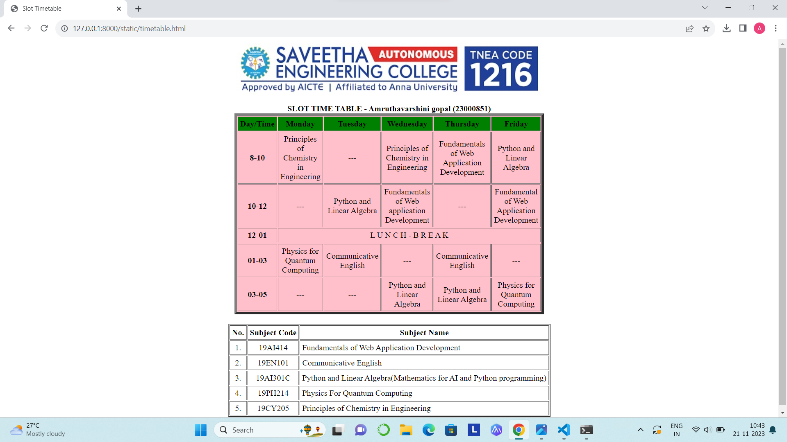

# Ex-04-Timetable

Name: Amruthavarshini gopal

Reference number: 23000851

Department: Artificial intelligence and Data science

# AIM:

To Write a html webpage page to display your timetable.

# ALGORITHM:

### STEP 1

Create a simple table using table tag

### STEP 2

Add header row using the tag

### STEP 3

Add your timetable

### STEP 4

Execute the program

# CODE:
```
<html>
<head>
<title>Slot Timetable</title>
</head>
<body>
<center>

</center>
<br>
<table align="center" width="540" cellspacing="2" cellpadding="4" border="5" bgcolor="pink">
<caption><b>SLOT TIME TABLE - Amruthavarshini gopal (23000851)</b></caption>
<tr align="center">
<th bgcolor="green">Day/Time</th>
<th bgcolor="green">Monday
<th bgcolor="green">Tuesday
<th bgcolor="green">Wednesday
<th bgcolor="green">Thursday
<th bgcolor="green">Friday
</tr>
<tr align="center">
<th bgcolor="pink">8-10</th>
<td >Principles of Chemistry in Engineering</td>
<td >---</td>
<td >Principles of Chemistry in Engineering</td>
<td >Fundamentals of Web Application Development</td>
<td >Python and Linear Algebra</td>
</tr>
<tr align="center">
<th bgcolor="pink">10-12</th>
<td >---</td>
<td >Python and Linear Algebra</td>
<td >Fundamentals of Web application Development</td>
<td >---</td>
<td >Fundamental of Web Application Development</td>
</tr>
<tr>
<th bgcolor="pink">12-01</th>
<td colspan="5" align="center"> L U N C H - B R E A K</td>
</tr>
<tr>
<tr align="center">
<th bgcolor="pink">01-03</th>
<td >Physics for Quantum Computing</td>
<td >Communicative English</td>
<td >---</td>
<td >Communicative English</td>
<td >---</td>
</tr>
<tr align="center">
<th bgcolor="pink">03-05</th>
<td >---</td>
<td >---</td>
<td >Python and Linear Algebra</td>
<td >Python and Linear Algebra</td>
<td >Physics for Quantum Computing</td>
</tr>
</table>
<br>
<table align="center" cellspacing="2" cellpadding="4" border="2">
<tr align="center">
<th>No.</th>
<th>Subject Code</th>
<th>Subject Name</th>
</tr>
<tr>
<td align="center">1.</td>
<td align="center">19AI414</td>
<td>Fundamentals of Web Application Development</td>
</tr>
<tr>
<td align="center">2.</td>
<td align="center">19EN101</td>
<td>Communicative English</td>
</tr>
<tr>
<td align="center">3.</td>
<td align="center">19AI301C</td>
<td>Python and Linear Algebra(Mathematics for AI and Python programming)</td>
</tr>
<tr>
<td align="center">4.</td>
<td align="center">19PH214</td>
<td>Physics For Quantum Computing</td>
</tr>
<tr>
<td align="center">5.</td>
<td align="center">19CY205</td>
<td>Principles of Chemistry in Engineering</td>
</tr>
</table>
</body>
</html>
```
# OUTPUT:





